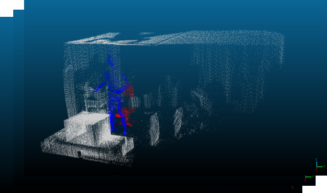

# LiDAR-Based Human Action Recognition Pipeline

  

This repository contains a **research & development pipeline** developed by **Yvan Ndong Ekouaga** as part of the course _IFT697 – Projet d’intégration et de recherche_ at the **University of Sherbrooke**.

The objective of the project is to study whether **human activities can be monitored using LiDAR sensors**, as an alternative to camera-based systems, mainly for **privacy reasons** (e.g. monitoring in sensitive environments such as bathrooms).

## Project Overview

The core hypothesis of this work is that a **human activity can be modeled as a sequence of poses**. The use case explored in this project is a **sit-to-stand movement using a walker**, where an incorrect motion could worsen injuries or health conditions.

The pipeline operates on **LiDAR point cloud sequences** and follows these main steps:

1. **Scene semantic segmentation** to detect objects of interest (humans, chairs)
2. **Point cloud filtering** to remove background elements
3. **Pose classification** based on the spatial relationship between the human and the chaiur
4. **Temporal analysis** of the pose sequence to recognize the activity

A more detailed explanation of the methodology, in French, is available in the accompanying [PDF](./report.pdf)

## Models

This project relies on **PointNet++** for two main tasks:

- **Scene semantic segmentation**  
  Used to identify objects such as _humans_ and _chairs_ in LiDAR point clouds.
- **Pose classification**  
  Used to classify the human pose relative to the chair once the scene has been segmented and filtered.

## Pipeline characteristics

- Containerized using **Docker**
- Designed for **offline inference** on pre-recorded point cloud sequences  
   (real-time inference is not implemented)

This project was developed as an academic prototype and contains known limitations.

## Datasets

Datasets, trained models, logs, and checkpoints are NOT included in this repository. The code assumes that datasets are prepared externally and placed in the expected directories (as described in the PDF).

## Status

- Research / academic prototype
- Not production-ready
- Intended for experimentation and learning purposes
